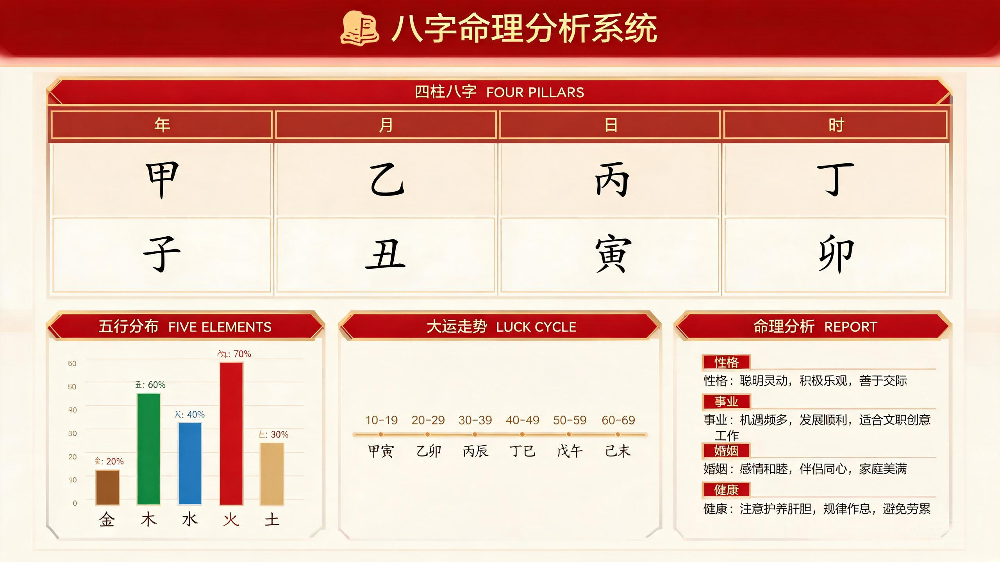

<div align="center">

# bazi-analyzer — 八字命理综合分析


**传统八字排盘 + 多维命理分析** Web 应用——真太阳时校准、起四柱，一站式输出性格 / 事业 / 婚姻 / 健康 / 大运 / 流年分析报告，支持单人详批与双人合盘。

</div>

---

## 🔮 这是什么？

bazi-analyzer 是一款 **八字（四柱）排盘与分析工具**：输入出生时间与经度，进行**真太阳时修正**后排出四柱，并从日主强弱 → 五行 → 用神 → 性格 → 事业 → 婚姻 → 健康 → 大运 → 流年 → 神煞 → 格局一站式生成可读报告，还支持**双人合盘**与 **recharts 可视化**。

## ✨ 核心功能

- 🧮 **排盘**：`lunar-javascript` 起四柱，支持**经度 ≠ 120** 时的真太阳时修正
- 📑 **多维分析**：日主强弱、五行平衡、用神喜忌、性格、事业、财富、婚姻、子女、健康、大运轨迹、流年、趋避等 15 项，每项带 `analysis` 文本与 `factors[]` 依据
- ⭐ **神煞体系**：完整实现 12 种神煞（天乙 / 文昌 / 桃花 / 驿马 / 将星 / 华盖 / 红鸾 / 天喜 / 孤辰 / 寡宿 / 天德 / 月德），吉凶判定
- 💞 **双人合盘**：天干化合 / 冲克、地支六合三合、用神互补、大运同步，生成**兼容度评分**
- 🧭 **格局判定** + **命盘保存/加载**（本地持久化）
- 📊 **数据可视化**：五行柱状图、大运时间线、流年图、合盘雷达图
- 🌌 **知识库**：廿八星宿、节气、命理规则表（数据驱动，与引擎解耦）

## 🧱 技术栈

| 层 | 技术 |
|----|------|
| 前端 | React 19 · TypeScript · Vite |
| 计算 | lunar-javascript · 自研 engine（真太阳时 / 强弱打分 / 神煞） |
| 图表 | recharts |
| 状态 | Zustand + persist |
| 本地 | sql.js（SQLite WASM） |

## 🏗️ 目录结构

```
src/
├── engine/            # baziCalculator / analysis / synastry / shensha / pattern
│                      # / derived / solarTerms / xingxiu / constants / types
├── data/              # knowledgeBase.ts（命理知识库 & 判定表）
├── store/useBaziStore.ts
├── components/
│   ├── charts/        #   DaYunTimeline / FiveElementChart / LiuNianChart / SynastryRadar
│   ├── effects/       #   ParticleBackground
│   └── layout/        #   Header / Sidebar / MainLayout
└── hooks/useReveal.ts # 渐显动画
```

## 🚀 快速开始

```bash
npm install
npm run dev
npm run build
```

> 纯前端，排盘与分析全部在浏览器完成，无后端。

## 📜 脚本

| 命令 | 说明 |
|------|------|
| `npm run dev` | 开发预览 |
| `npm run build` | 构建生产产物 |
| `npm run preview` | 预览构建产物 |

## 🖼️ 界面预览



*排盘结果 + 五行图表 + 分析报告。*

---

<div align="center">Made by jimmma</div>